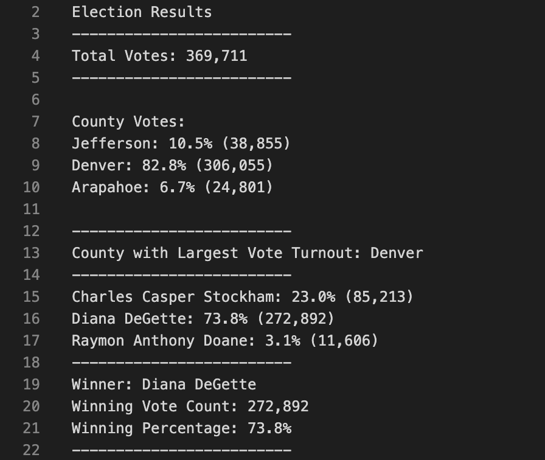
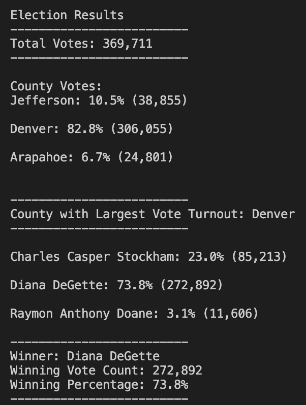

# Election Analysis

## Overview of Election Audit

A Colorado Board of Elections employee has asked for the following data to complete the election audit of a recent local congressional election.

1. The total amount of votes cast in this congressional election.
2. A list of candidates who received votes (and how many) and the percentage of total votes per county.
3. The county with the largest number of votes.
4. Determine the winner of the election based, their vote count, and their vote percentage.

# Analysis Resources 

- Data Source: election_results.csv

- Software: Python 3.6.1, Visual Studio Code, 1.38.1

# Election - Audit Results

The analysis of the congressional election show that:

There were 369,711 votes cast in the election.

The candidates were:

  * Charles Casper Stockham 
  
  * Diana DeGette
  
  * Raymon Anthony Doane

The county with the biggest amount of votes was: 

  - Denver 

In terms of voter turnout and the amount of votes per county, the results were as followed:

  - Jefferson county had 38,855 votes and a 10.5% voter turnout.

  - Denver county had 306,055 votes and an 82.8% voter turnout.

  - Arapahoe county had 24,801 votes and a 6.7% voter turnout.

The candidate results were as followed:

  - Charles Casper Stockham received 23.0% of the votes and 85,213 number of votes.
  
  - Diana DeGette received 73.8% of the votes and 272,892 number of votes.
  
  - Raymon Anthony Doane received 3.1% of the votes and 11,606 number of votes.
  
The winner of the election was:
  - Diana DeGette, who received 73.8% of the vote and 272,892 number of votes.
  
The results from the terminal correlate to the same results shown earlier from the election_results.txt file.

  
# Election-Audit Summary  
 Through the use of a Python script, we were able to achieve a good insight for the important statistical numbers of the election such as voter turnout percentage, and quantity of votes. This script could be used for any election by simply modifying the csv file and adjusting lines of code s needed for any sort of questions that are hoped to be answered through an in-depth analysis. 
 
 In terms of suggestions for modifying the script to achieve this, there are two possible proposals:
 1. This script could be used to include a broader range of counties and candidates for example, and not only be contained to analyzing results in the three we used in this challenge.
 2. Another proposal could be modifying the script to demonstrate in the analysis which candidate won in each particular county. 
 3. Lastly, the script could be modified to be more user-friendly and have users themselves select which county or candidate they would like to view results for. 
  
  
